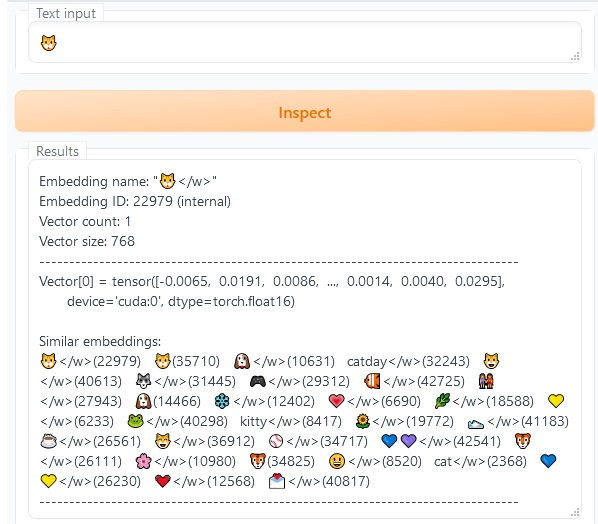
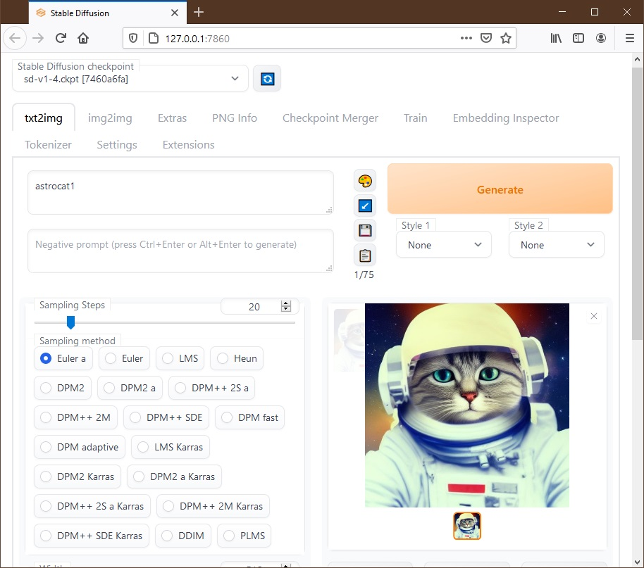
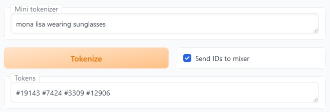
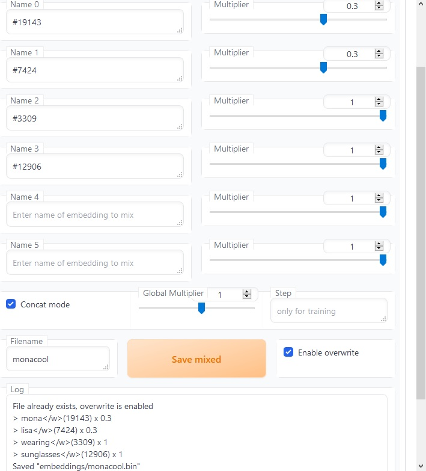
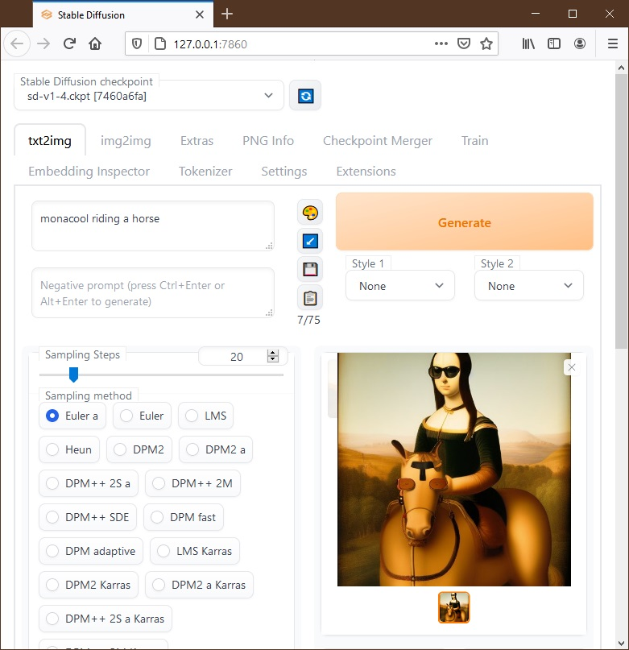

# Embedding-inspector extension version 2.5 - 2022.12.08
for 

With this extension you can inspect internal/loaded embeddings and find out which embeddings are similar, and you can mix them to create new embeddings.

Inspired by [Embeddings editor](https://github.com/CodeExplode/stable-diffusion-webui-embedding-editor.git) and  extensions.

# What's new

v2.0: SD2.0 and multi-vector support 

v2.1: Entering embedding ID instead of name is now supported, for example you can enter "#2368" instead of "cat"

v2.2: Entering a step value (like 1000) is now supported. This is needed only if you will continue training this embedding. Also, step and checkpoint info for loaded embeddings are now displayed.

v2.3: Added "List loaded embeddings" button

v2.4: Added "Concat mode" option. In this mode, embeddings will be just combined instead of being mixed. For example, "mona" and "lisa" can be combined into a single embedding "monalisa" which will contain 2 vectors, and the result will be the same as having "mona lisa" in the prompt, but with a single keyword.

v2.5 Added "global multiplier" option, which is useful to adjust strength in concat mode. Added a mini tokenizer. You can select "Send IDs to mixer" option to automate converting a short prompt to an embedding.

v.252 Added an experimental eval feautre. Text entered in Eval box will be evaluated and applied to the saved embedding. Not exactly useful, but see bottom of this page for usage.

# Manual Installation

Download  and extract into extensions folder.

# Usage

1) Enter a token name into "Text Input" box and click "Inspect" button. Only the first token found in the text input will be processed. Below, some information about the token will be displayed, and similar embeddings will be listed in the order of their similarity. This is useful to check if a word is in the token database, find internal tokens that are similar to loaded embeddings, and also to discover related unicode emojis.

2) Enter one or more token names in the "Name 0", "Name 1"... boxes, adjust their weights with "Multiplier" sliders, enter a unique name in "Filename" box, click "Save mixed" button. This will create a new embedding (mixed from the given embeddings and weights) and save it in the embeddings folder. If the file already exists, "Enable overwrite" box must be checked to allow overwriting it. Then, you use the filename as a keyword in your prompt.

3) Enter a short prompt in mini tokenizer text box, select "Send IDs to mixer" option, click "Tokenize". In the mixer section IDs will have been copied and "Concat mode" checked. Adjust multiplier and global multiplier sliders if necessary, enter a filename and click "Save mixed" button. Then use the filename as a keyword in your prompt.

# Background information

Stable Diffusion contains a database of ~49K words/tokens, and their numerical representations called embeddings. Your prompt is first tokenized using this database. For example, since the word "cat" is in the database it will be tokenized as a single item, but the word "catnip" is not in the database,  so will be tokenized as two items, "cat" and "nip". 

New tokens/concepts can also be loaded from embeddings folder. They are usually created via textual inversion, or you can download some from [Stable Diffusion concepts library](https://huggingface.co/sd-concepts-library). With Embedding-inspector you can inspect and mix embeddings both from the internal database and the loaded database.

#Eval feature

Embeddings consist 768 or 1024 numbers, these numbers determine the generated image, but what each number controls is a mystery. With eval feature you can zero/modify some of these numbers to see what happens.

Enter an embedding name like "cat" in "Name 0" box, type a filename like "evaltest" and check "enable overwrite", enter the eval string in "Eval" box, click "save mixed".  You can check log for errors, and also inspect "evaltest" to see that the values have changed. Then generate the image in txt2img tab with the prompt "evaltest" to see the effect.

In the Eval string, use v as the original vector. Torch and math functions are available.

Examples:

Eval "v-torch.min(v)" shifts all numbers up to the positive range, seems to have no effect.

Eval "torch.relu(v)" zeroes all negative numbers.

Eval "torch.abs(v)" makes all values positive.

Eval " = torch.ceil(v)" rounds all values

If the Eval string starts with "=", evaluation will be done item-wise. Here available variables are : v=original value, i=item no (0:768 or 0:1024), maxi=item count (768 or 1024)

Eval " = v*(i<100)" zeroes items after 100th

Eval " = v*(i<maxi//2)" zeroes items in the upper half.

Eval " = v*(i>100 and i<200)" zeroes all items except between 100th and 200th.

Eval " = v*(i<400 or i>500)" zeroes all items between 400th and 500th.
